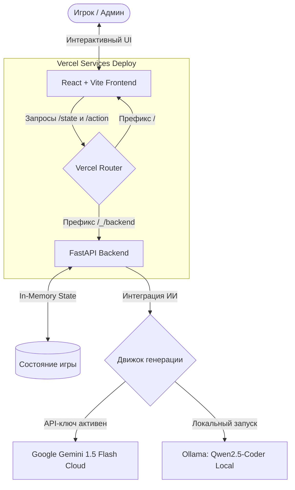

# 🎮 Toxic Cybercafe Admin (Администратор Токсичного Компьютерного Клуба)

[](https://fastapi.tiangolo.com)
[](https://reactjs.org)
[](https://vitejs.dev)
[](https://deepmind.google/technologies/gemini/)
[](https://ollama.com)
[](https://vercel.com)

> 📟 *«Админ, сука, пинг 300 в КС! Сделай чё-нибудь или верни деньги!»*  
> Добро пожаловать в суровый симулятор администратора компьютерного клуба конца 2000-х в типичном постсоветском городе. Управляйте лояльностью клиентов, кормите их дошираками, решайте сетевые сбои, выгоняйте неадекватов и общайтесь с ними через **искусственный интеллект**, говорящий на чистейшем геймерском слэнге!

---

## 🚀 Почему этот проект взрывает? (Ключевые фичи)

*   **🧠 Интеллектуальный Движок Геймеров (GenAI-Driven NPC):** Каждая жалоба, каприз и гневный крик генерируются на лету большой языковой моделью (**Google Gemini 1.5 Flash** в облаке или локальная **Ollama: Qwen2.5-Coder**). Никаких заготовленных фраз — каждый раунд уникален!
*   **🎭 Колоритные Персонажи с Характером:**
    *   **Дима 😡 (Агрессор):** Всегда прав, угрожает жалобами, Роспотребнадзором и старшим братом.
    *   **Бауыржан 🤝 (Бизнесмен):** Упрямый, торгуется за каждую минуту, любит фразу *«я плачу деньги»*.
    *   **Серёга 🥺 (Нытик):** Жалуется на пыль, пинг, холод, стул и судьбу.
    *   **Артём 👶 (Школьник):** Общается исключительно на зумерско-геймерском слэнге (*«gg ez»*, *«кринж»*, куча эмодзи).
    *   **Жека 🚬 (Олд):** 35-летний дотер, который помнит клуб «Матрица» в 2007-м и сравнивает современный клуб с ним.
*   **🛠 Полный Пульт Управления Клубом:** В вашем арсенале десяток реальных админских действий:
    *   `⏱ Добавить время` — продлить кайф геймера.
    *   `🍔 Принести дошик` — спасти от голодной смерти и токсичности.
    *   `🔌 Заменить девайс` — дать рабочую мышку взамен разбитой.
    *   `❄️ Включить кондёр` — охладить пыл и проветрить зал.
    *   `🤫 Заткнуть соседа` — усмирить орущего дотера.
    *   `🛜 Починить сеть` — сбросить роутер (главное не выключить его во время важной катки!).
    *   `🏷 Выдать промокод` — задобрить скидкой особо токсичного гостя.
    *   `🔄 Перезагрузить ПК` / `🚫 Кикнуть/Забанить` — радикальные меры для крайних случаев.
*   **💬 Свободный ИИ-Чат:** Напишите клиенту *любой* свой текст! Нейросеть оценит адекватность вашего ответа, рассчитает изменение лояльности в реальном времени и выдаст сочную текстовую реакцию в характере игрока.

---

## 🗺 Архитектура Системы

Игра построена на современном стеке с микросервисным разделением и готова к мгновенному развертыванию на Vercel в один клик:



---

## ⚡️ Быстрый старт (Локально)

### 1. Требования
*   Node.js (v18+)
*   Python (v3.10+)
*   API Ключ **Google Gemini** (рекомендуется для облачного деплоя) ИЛИ установленная **Ollama** для локальной генерации.

### 2. Клонирование и настройка окружения
```bash
git clone https://github.com/semeikhan-t/nfactorial_ai.git
cd nfactorial_ai
```

Создайте файл `backend/.env` и заполните его:
```env
GEMINI_API_KEY=your_gemini_api_key_here
# Если используете Ollama локально вместо Gemini:
# OLLAMA_URL=http://localhost:11434/api/generate
# OLLAMA_MODEL=qwen2.5-coder:7b
```

### 3. Автоматический запуск (Одной командой!)
Мы подготовили удобный bash-скрипт, который автоматически поднимет и бэкенд, и фронтенд:
```bash
chmod +x start.sh
./start.sh
```

---

## ⚙️ Пошаговый ручной запуск

Если вы хотите запустить сервисы в разных терминалах:

### Бэкенд (FastAPI)
```bash
cd backend
python3 -m venv venv
source venv/bin/activate
pip install -r requirements.txt
python3 main.py
```
*Бэкенд будет доступен по адресу `http://localhost:8000` (Документация Swagger: `http://localhost:8000/docs`)*

### Фронтенд (React + Vite)
```bash
cd frontend
npm install
npm run dev
```
*Фронтенд запустится на `http://localhost:5173`*

---

## ☁️ Деплой на Vercel (Services Mode)

Проект полностью оптимизирован под мульти-сервисный деплой Vercel с использованием конфигурации `vercel.json` в корне репозитория:

```json
{
    "experimentalServices": {
        "frontend": {
            "root": "frontend",
            "routePrefix": "/",
            "framework": "vite"
        },
        "backend": {
            "root": "backend",
            "entrypoint": "main.py",
            "routePrefix": "/_/backend"
        }
    }
}
```

### Инструкция по деплою:
1. Загрузите проект на свой GitHub.
2. Подключите репозиторий в панели **Vercel**.
3. В настройках проекта (**Settings > General**):
   * Установите **Framework Preset** в значение **Services** (это критически важно для работы `experimentalServices`).
4. В разделе **Environment Variables** добавьте:
   * `GEMINI_API_KEY` = *ваш ключ Gemini* (для ИИ-логики).
   * `VITE_API_URL` = `/_/backend` (чтобы фронтенд автоматически общался с бэкендом на одном домене).
5. Нажмите **Deploy**! Проект соберется и запустится на едином домене без проблем с CORS.

---

## 💡 Идеи для развития (Монетизация & Геймификация)

Хотите сделать проект еще более крутым? Вот пара направлений для масштабирования:

1.  **🏪 Магазин дошираков и энергетиков:** Добавьте экономическую систему. Зарабатывайте деньги с аренды компьютеров и продавайте еду, апгрейдите компьютеры (покупайте RTX 5090 вместо лагающих карт), чтобы лояльность росла быстрее.
2.  **🏆 Таблица лидеров (Leaderboard):** Интегрируйте базу данных (например, Supabase или PostgreSQL) для сохранения рекордов админов. Кто продержался дольше всех и набрал максимальный Score?
3.  **🔊 Звуковые эффекты:** Подключите звуки кликов клавиатур, криков дотеров на заднем фоне и шипения завариваемого дошика для 100% погружения в атмосферу.

---

Разработано с ❤️ и юмором в рамках nfactorial. Тащите катки и держите лояльность на соточке! 🚀
